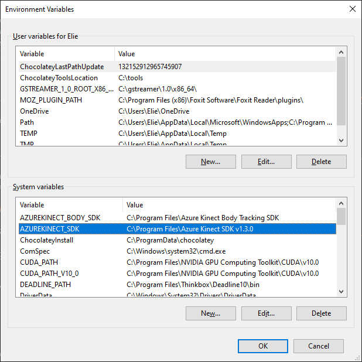
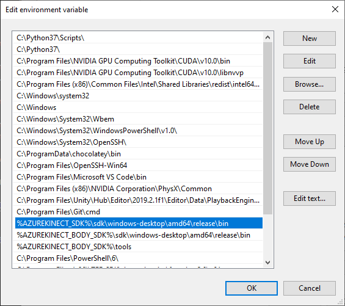

# Step Azure Kinect Demo
Created by: Amon Millner, Richard Gao, Hwei-Shin Harriman for Vision.  
Features implemented:  
* Stick figure dummy bodies, 1 per person
* Stomp detection
* Clap detection
* Emotion classification using Azure Kinect
* Sound FX capabilities, can be played upon registering a stomp or a clap
* Visual representation of emotion (classification affects background color)

## Installation Instructions
(Assumes Windows OS and Azure Kinect SDK has been set up according to the [Azure Kinect Documentation](https://docs.microsoft.com/en-us/azure/kinect-dk/set-up-azure-kinect-dk).)  
Instructions modified from [this](https://github.com/prisonerjohn/ofxAzureKinect) Open Frameworks example repository.
* Install OpenFrameworks by following instructions at the [OpenFrameworks Website](https://openframeworks.cc/setup/vs/)
* Install the [Azure Kinect Sensor SDK](https://docs.microsoft.com/en-us/azure/Kinect-dk/sensor-sdk-download).
* Install the [Azure Kinect Body Tracking SDK](https://docs.microsoft.com/en-us/azure/Kinect-dk/body-sdk-download).
* Add an environment variable for `AZUREKINECT_SDK` and set it to the Sensor SDK installation path (no trailing slash). The default is `C:\Program Files\Azure Kinect SDK v1.3.0`.
* Add an environment variable for `AZUREKINECT_BODY_SDK` and set it to the Body SDK installation path (no trailing slash). The default is `C:\Program Files\Azure Kinect Body Tracking SDK`.

    

* Add the path to the Sensor SDK `bin` folder to the `PATH` variable. The default is `%AZUREKINECT_SDK%\sdk\windows-desktop\amd64\release\bin`.
* Add the path to the Body SDK `bin` folder to the `PATH` variable. The default is `%AZUREKINECT_BODY_SDK%\sdk\windows-desktop\amd64\release\bin`.
* Add the path to the Body SDK `tools` folder to the `PATH` variable. The default is `%AZUREKINECT_BODY_SDK%\tools`.

    

* Clone this repository in your openFrameworks `addons` folder.
* Copy the cuDNN model file `dnn_model_2_0.onnx` from the Body SDK `tools` folder into your project's `bin` folder!
* TODO instructions for Azure Kinect Setup.
* You can then open the `.sln` file in Visual Studio and build. 
